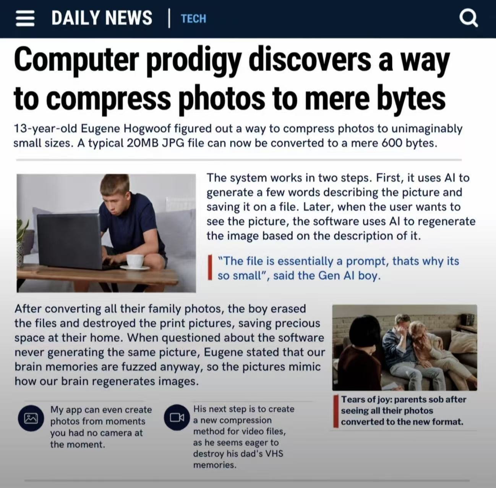

# 天才的照片压缩术：照片没了，Prompt 还在

看到这个感觉是个天才，快笑喷了。

图片里的思路是：先让 AI 把照片描述成文字，只保存这段 Prompt；想看照片时，再让 AI 按描述生成一张。

我看完只想说：好家伙，别人压缩的是文件，你压缩的是回忆。

最绝的不是省空间，而是照片对不上也能解释——反正人的记忆本来就模糊。顺着这个逻辑想下去，以后翻相册，看的不是“那年我们去了哪里”，而是“AI 觉得那年我们大概去了哪里”。

建议给它起名：**全损压缩，随机解压。**

## 中文翻译图

*来源：原帖二楼，DeaBingFeng 发布的翻译版。*

## 英文原图

*来源：原帖一楼，yyf 发布的图片。*

## 来源与备注

- 原帖：[计算机天才发现了一种将照片压缩到仅几字节的方法](https://linux.do/t/topic/2851819)
- 收录日期：2026-09-08。
- 本文按趣图整理，不将图中人物、数字或故事作为已核实新闻；以上吐槽为个人随记。
- 两张图片均下载为本地文件，未改动图片内容；这里只收录主帖原图及二楼翻译版，不包含其余评论配图。
